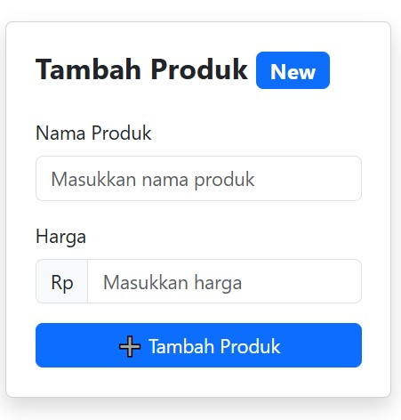
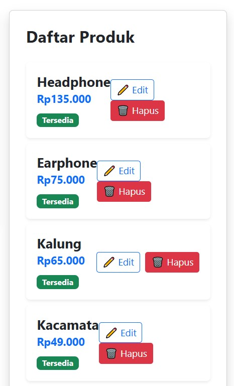
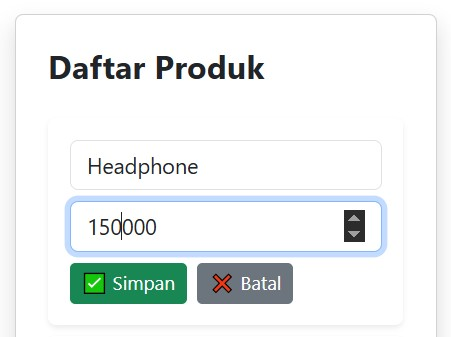
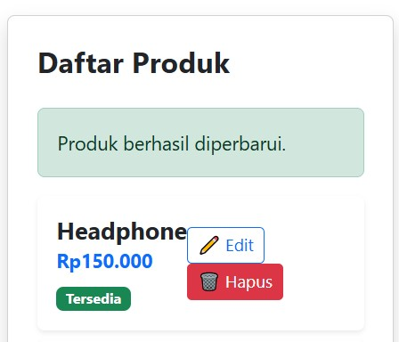
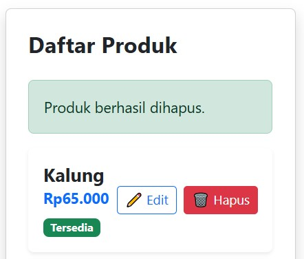

# APLIKASI E-COMMERCE SEDERHANA
Aplikasi ini adalah Product Management App, sebuah sistem sederhana untuk mengelola daftar produk. Pengguna dapat menambahkan, melihat, mengedit, dan menghapus produk melalui antarmuka berbasis web. Backend menggunakan Express.js dan database PostgreSQL, sedangkan frontend dibangun dengan React.js.
### Fitur Utama ###
1. Menambah Produk<br>
<br><br>
2. Menampilkan Daftar Produk<br>
<br><br>
3. Mengupdate Produk<br>
<br>
<br><br>
4. Menghapus Produk<br>
<br><br>
### Teknologi yang Digunakan ###
Proyek ini dibuat dengan  menggunakan teknologi sebagai berikut:
- **Frontend**: React.js dengan Bootstrap untuk styling.
- **Backend**: Node.js dengan Express.js.
- **ORM/Query Builder**: pg (node-postgres).
- **Package Manager**: npm
- **Middleware**: CORS dan Express.json untuk komunikasi antara frontend dan backend.
<br>

## Fitur yang ada di dalam program
- **Tambah Produk☑️**
- **Melihat List Produk☑️**
- **Edit Produk☑️**
- **Hapus Produk☑️**
- **Notif Toaster☑️**
- **Validasi Input☑️**
## Instalasi & Konfigurasi ###


### Menyalin repository ke lokal

```bash
git clone <URL_REPO_USER>
cd <NAMA_FOLDER_REPO>
```

### Menginstall Dependencies ##
```js
cd <NAMA-FOLDER-FRONTEND>
npm install
```
**Konfigurasi Database**
```js
const { Pool } = require("pg");

const pool = new Pool({
  user: "postgres",      // Ganti dengan user database
  host: "localhost",     
  database: "produk_db", // Ganti dengan nama database user
  password: "password",  // Ganti dengan password database user
  port: 5432,            // Sesuaikan dengan port database
});

module.exports = pool;
```
<br>

### Menjalankan Aplikasi ## 
- Backend
  ```js
  node index.js
  ```
- Frontend
  ```js
  npm run dev
  ```
  <br>
## Struktur Proyek
```bash
proyek/
|--backend/
|  |--db.js
|  |--index.js
|  |__package.json
|--frontend/
|  |--src\
|  |  |--components\
|  |  |  |--ProdukList.jsx
|  |  |  |__TambahProduk.jsx
|  |--App.css
|  |__App.jsx
|__data.rest
```
<br>

## Endpoint API ##
| Method | Endpoint          | Fungsi                  |
|--------|-------------------|-------------------------|
| GET    | /produk           | Ambil semua produk      |
| POST   | /produk           | Tambah produk baru      |
| PUT    | /produk/:id       | Update produk           |
| DELETE | /produk/:id       | Hapus produk            |

<br>

## Pengerjaan Proyek Ini di lakukan:
Varrel Kaleb Ropard Pasaribu - (10231089) FrontEnd <br>
Betran - (10231023) BackEnd
